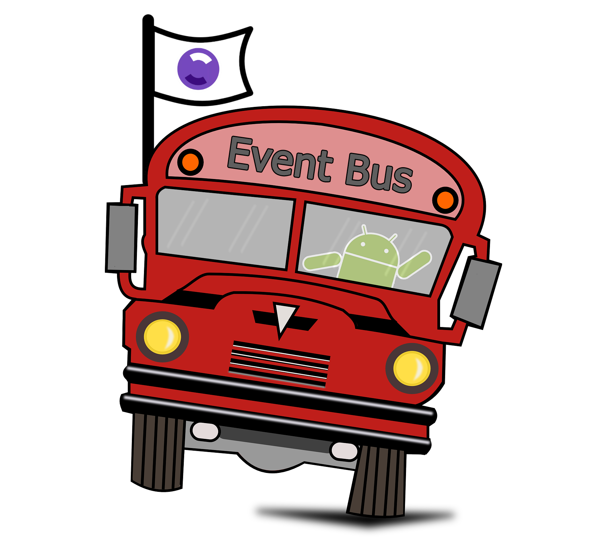
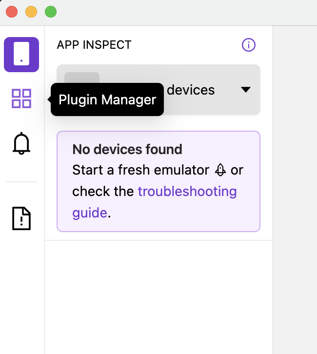
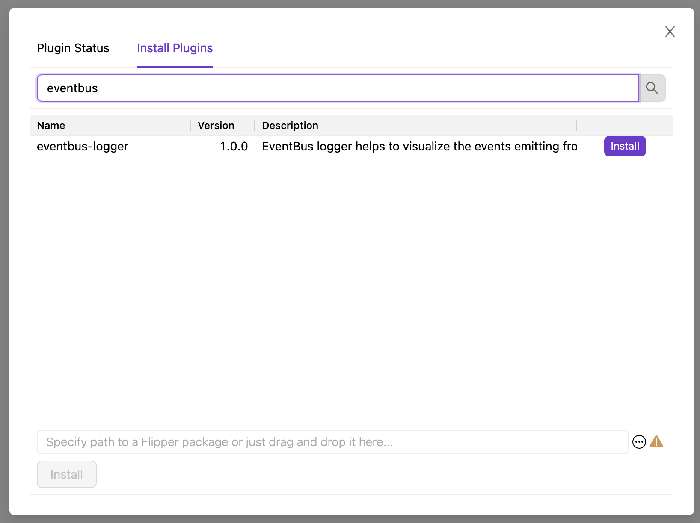

[](https://github.com/SaqibJDev/EventBusLogger-Flipper/network)
[](https://github.com/SaqibJDev/EventBusLogger-Flipper/stargazers)
[](https://github.com/SaqibJDev/EventBusLogger-Flipper/issues)
[](https://github.com/SaqibJDev/EventBusLogger-Flipper/blob/main/LICENSE)


<!-- PROJECT LOGO -->
<br />
<p align="center">
  <a href="https://github.com/SaqibJDev/EventBusLogger-Flipper">
    
  </a>

  <h3 align="center">EventBus Logger - Flipper plugin</h3>

  <p align="center">
    Visualize your events in Flipper to analyze and debug your application.
    <br />
    <a href="https://github.com/SaqibJDev/EventBusLogger-Flipper"><strong>Explore the docs »</strong></a>
    <br />
    <br />
    <a href="https://github.com/SaqibJDev/EventBusLogger-Flipper">View Demo</a>
    ·
    <a href="https://github.com/SaqibJDev/EventBusLogger-Flipper/issues">Report Bug</a>
    ·
    <a href="https://github.com/SaqibJDev/EventBusLogger-Flipper/issues">Request Feature</a>
  </p>
</p>


<!-- TABLE OF CONTENTS -->
<details open="open">
  <summary><h2 style="display: inline-block">Table of Contents</h2></summary>
  <ol>
    <li>
      <a href="#introduction">Introduction</a>
      <ul>
        <li><a href="#built-with">Built With</a></li>
      </ul>
    </li>
    <li>
      <a href="#getting-started">Getting Started</a>
      <ul>
        <li><a href="#prerequisites">Prerequisites</a></li>
        <li><a href="#installation">Installation</a></li>
        <li><a href="#application-setup">Application setup</a></li>
        <li><a href="#flipper-setup">Flipper setup</a></li>
      </ul>
    </li>
    <li><a href="#usage">Usage</a></li>
    <li><a href="#roadmap">Roadmap</a></li>
    <li><a href="#contributing">Contributing</a></li>
    <li><a href="#license">License</a></li>
    <li><a href="#contact">Contact</a></li>
    <li><a href="#acknowledgements">Acknowledgements</a></li>
  </ol>
</details>


<!-- ABOUT THE PROJECT -->
## Introduction

[![Product Name Screen Shot][product-screenshot]](https://example.com)

EventBus Logger flipper is an event inspector to visualize the <a href="https://github.com/greenrobot/EventBus">GreenBot EventBus'</a> event traffic from a mobile app. The mobile app plugin acts as an interceptor for the events, collects each event data and sends to the Flipper desktop plugin. Any additional data can be send but plugin supports timestamp, eventType, stacktrace and eventBody out of the box.

This Plugin is especially helpful during the debugging phase to track-down the events and their removal along the course of app feature usage.  


### Built With

* [flipper-plugin](https://fbflipper.com/docs/tutorial/intro)
* [EventBus](https://github.com/greenrobot/EventBus)

<!-- GETTING STARTED -->
## Getting Started

In order to use the EventBus logger, follow these steps.

### Prerequisites

You'll need to integrate the Flipper in your app. Follow the official instructions [here](https://fbflipper.com/docs/getting-started/index).  


### Installation
#### Application setup
1. Clone the repo
   ```sh
   git clone https://github.com/SaqibJDev/EventBusLogger-Flipper.git
   ```
2. Copy the Android plugin in your app.
3. Register the Plugin with flipper client at app startup. (Please see the sample app for a reference)
4. Adapt your eventbus base class to add EventBusLoggerFlipperPlugin as an interceptor.
5. Install the app on the device or an emulator

#### Flipper setup
1. Open Flipper App
2. Open Plugin Manager from left top
3. Select install plugins
4. Search for `eventbus`
5. Install eventbus-logger
6. Reload Flipper
<p align="center">

    
  </p>


<!-- USAGE EXAMPLES -->
## Usage
Once the setup is done and app is installed, FLipper will recognize your app supporting EventBusLogger. It will be shown in the list of active plugins with a bus icon. Select the plugin to visualize the event traffic.
In order to see the details, simply click on any event row.

The plugin supports the following details:
1. Event Class name
2. Event type (Post Event, Post Sticky, Remove Sticky)
3. Timestamp 
4. Details
   1. Key Value map data (if sent via application plugin)
   2. Json Event Body (if class has data members)
   3. Stacktrace to trace down the event execution

<!-- ROADMAP -->
## Roadmap

See the [open issues](https://github.com/SaqibJDev/EventBusLogger-Flipper/issues) for a list of proposed features (and known issues).

<!-- CONTRIBUTING -->
## Contributing

Contributions are what make the open source community such an amazing place to learn, inspire, and create. Any contributions you make are **greatly appreciated**.

1. Fork the Project
2. Create your Feature Branch (`git checkout -b feature/AmazingFeature`)
3. Commit your Changes (`git commit -m 'Add some AmazingFeature'`)
4. Push to the Branch (`git push origin feature/AmazingFeature`)
5. Open a Pull Request

<!-- LICENSE -->
## License

Distributed under the MIT License. See `LICENSE` for more information.


<!-- CONTACT -->
## Contact

Hafiz Saqib Javed - [@Saqib_J](https://twitter.com/Saqib_J) - saqib.javed87@gmail.com

Project Link: [https://github.com/SaqibJDev/EventBusLogger-Flipper](https://github.com/SaqibJDev/EventBusLogger-Flipper)

